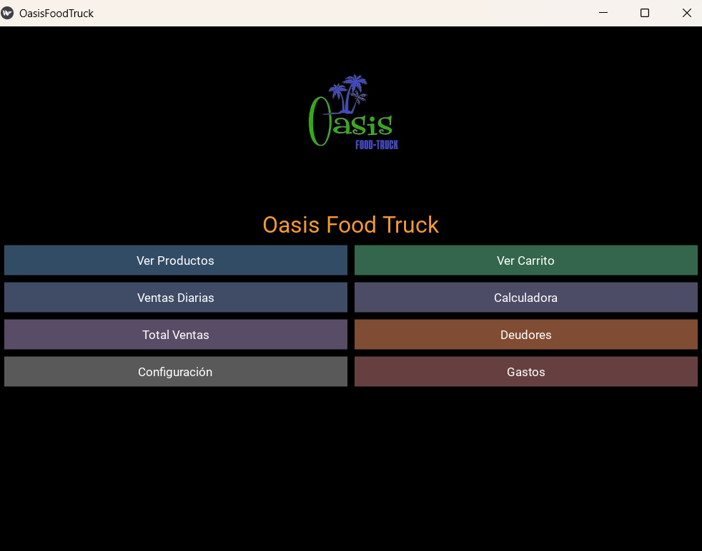
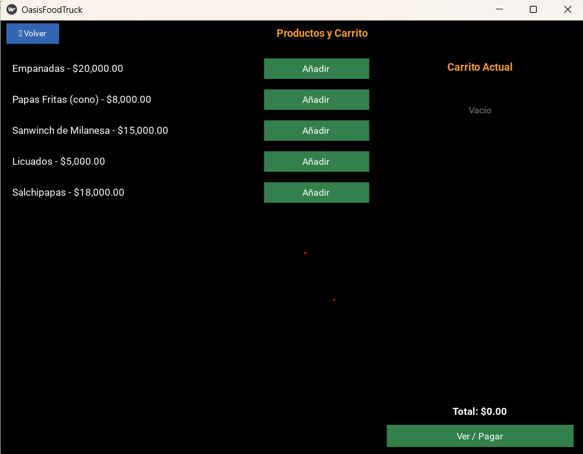
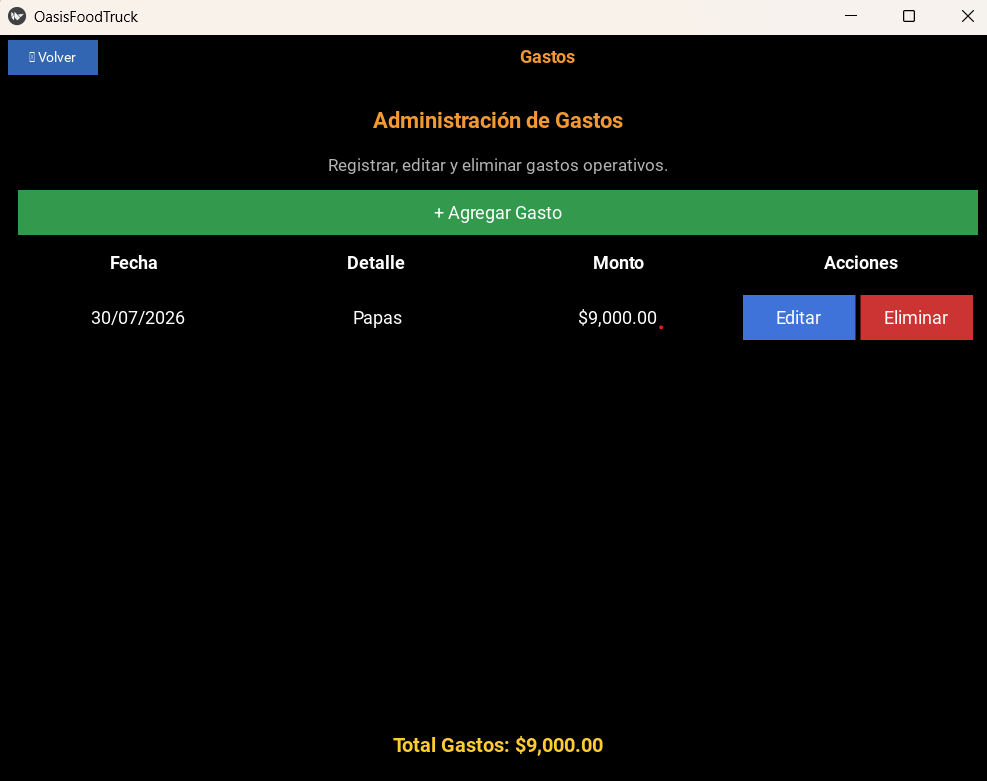
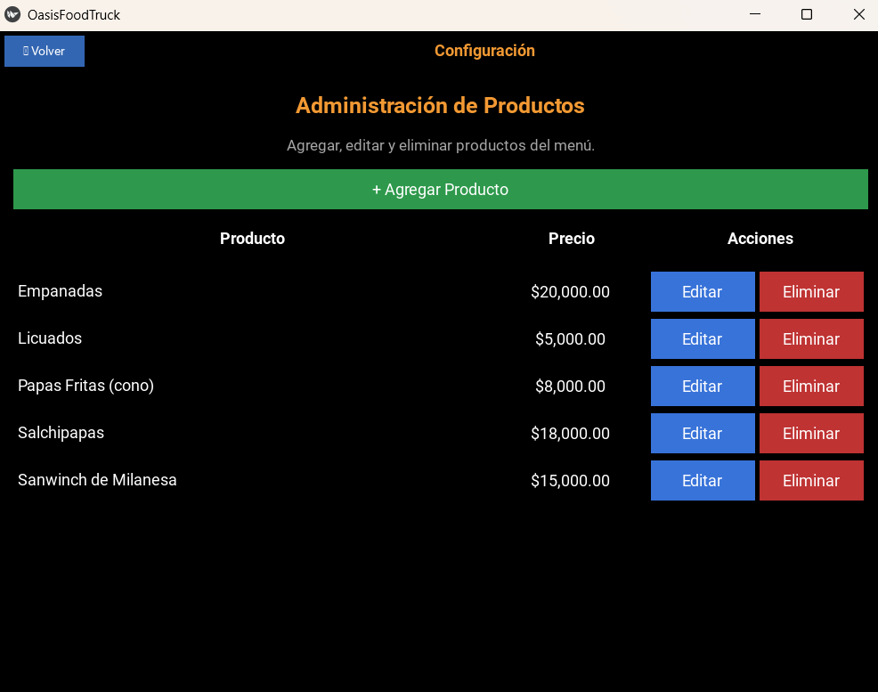

# 🌮 Oasis Food Truck

Sistema de gestión para un Food Truck desarrollado en **Python** utilizando **Kivy** como interfaz gráfica y **SQLite** como base de datos.

El sistema permite administrar las ventas diarias, productos, gastos y clientes deudores desde una única aplicación de escritorio.

---

# Características

## Ventas
- Registro de ventas
- Carrito de compras
- Cálculo automático del total
- Diferentes métodos de pago
- Historial de ventas

## Productos
- Alta de productos
- Eliminación de productos
- Modificación de precios
- Gestión del catálogo

## Gastos
- Registro de gastos operativos
- Categorías de gastos
- Historial de gastos
- Eliminación de gastos

## Deudores
- Registrar ventas fiadas
- Listado de deudores
- Marcar deuda como pagada

## Configuración
- Administración del sistema
- Gestión de productos
- Configuración general

---

# Tecnologías utilizadas

- Python 3
- Kivy
- SQLite
- Pillow

---

# Estructura del proyecto

```
OasisFoodTruck/
│
├── assets/
├── database/
│   └── Oasis.db
├── static/
├── main.py
├── requirements.txt
├── buildozer.spec
└── README.md
```

---
# Capturas de pantalla

## Pantalla principal



## Productos




## Gastos



## Deudores


## Configuración



---

# Instalación

Clonar el repositorio

```bash
git clone https://github.com/CarinaCB/OasisFoodTruck.git
```

Entrar al proyecto

```bash
cd OasisFoodTruck
```

Crear entorno virtual

Windows

```bash
python -m venv .venv
```

Activar entorno

```bash
.venv\Scripts\activate
```

Instalar dependencias

```bash
pip install -r requirements.txt
```

Ejecutar

```bash
python main.py
```

---

# Base de datos

La aplicación utiliza SQLite.

Archivo:

```
database/Oasis.db
```

---

# Estado del proyecto

Actualmente incluye:

- Gestión de productos
- Gestión de ventas
- Gestión de gastos
- Gestión de deudores
- Configuración del sistema

Próximas mejoras:

- Dashboard con estadísticas
- Reportes en PDF
- Exportación a Excel
- Búsqueda de ventas
- Edición de productos
- Gestión de stock

---

# Autor

**Carina Belén Coliluan**

GitHub:
https://github.com/CarinaCB
